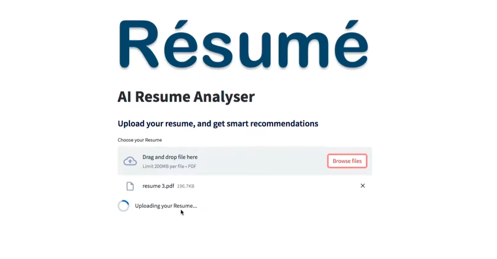
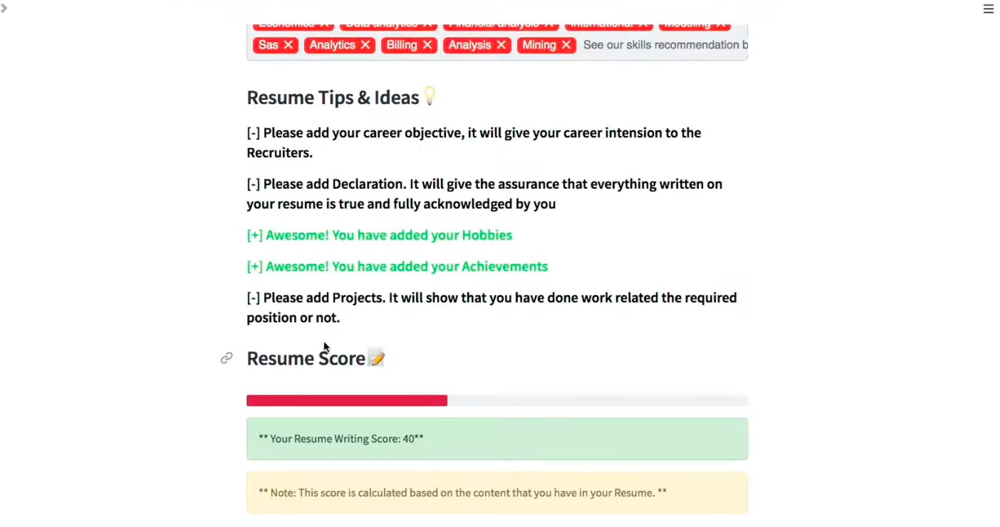
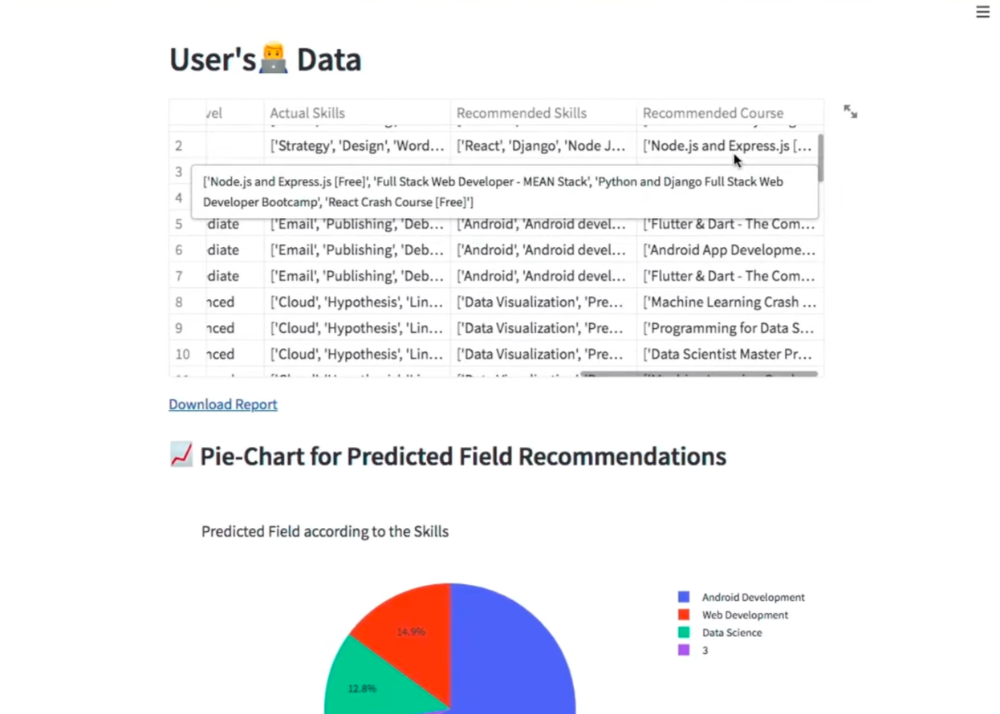
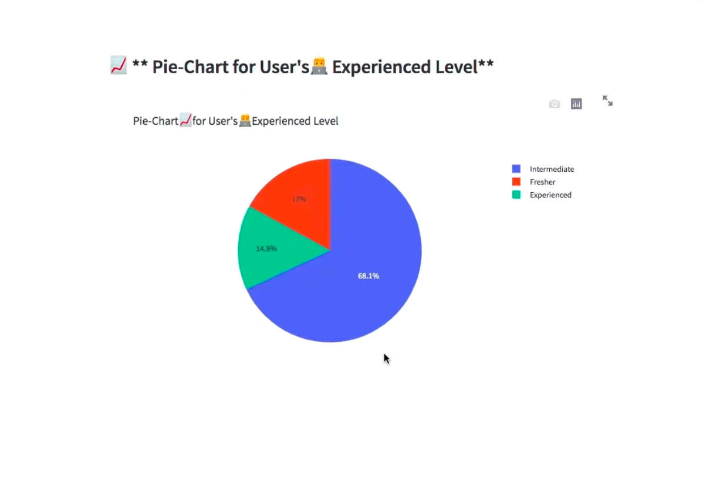

# 🧠 ATS-Friendly Resume Screening using NLP

This project is a **Resume Screening Web App** built using **Natural Language Processing (NLP)** and **Streamlit**.  
It helps recruiters and job seekers evaluate how well a resume matches a given job description by calculating an **ATS (Applicant Tracking System) Score** out of 100.  

The app analyzes resumes (PDF format) using text extraction and NLP to identify skills, experience, and relevant keywords — providing a quick insight into how “ATS-friendly” a resume is.

---

## 🚀 Features

- Upload and analyze resumes in **PDF format**
- Extract resume text using **pdfminer3**
- Perform **keyword and skills matching** with job descriptions
- Display an **ATS score** (out of 100)
- Interactive visualization using **Plotly**
- Simple and attractive **Streamlit UI**
- Resume data parsing with **PyResparser**
- Tagging input support with **streamlit-tags**

---

## 🧩 Tech Stack & Libraries Used

| Category | Libraries |
|-----------|------------|
| **Frontend** | Streamlit, streamlit-tags, Plotly |
| **Backend** | Python, Pandas, Pymysql |
| **NLP & Resume Parsing** | pdfminer3, pyresparser |
| **Media & Utilities** | Pillow, Pafy |

---

## 🛠️ Installation and Setup

Follow the steps below to set up this project on your local machine 👇

 
```

1️⃣ Clone this repository
bash
git clone https://github.com/your-username/ats-resume-screening-nlp.git
cd ats-resume-screening-nlp

2️⃣ Create a virtual environment (optional but recommended)
python -m venv venv
venv\Scripts\activate   # For Windows
# or
source venv/bin/activate   # For macOS/Linux

3️⃣ Install dependencies
pip install -r requirements.txt

4️⃣ Run the Streamlit app
streamlit run app.py

Then open the link shown in your terminal — usually http://localhost:8501/.
git clone https://github.com/your-username/ats-resume-screening-nlp.git
cd ats-resume-screening-nlp
```

## 📊 Example Output

| Section | Screenshot |
|----------|-------------|
| **1. Home Page** |  |
| **2. Resume Upload Section** |  |
| **3. ATS Score Result** |  |
| **4. Skill Matching Visualization** | 
| **4. Skill Matching Visualization** | 

